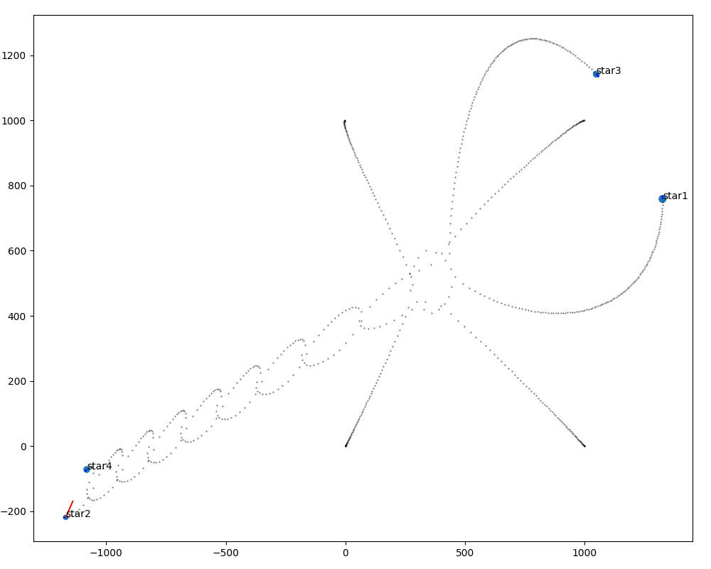

# Stars with Cython

Simple test of simulation newton's gravitational equation with Python. It's the most direct implementation, and likely quite unoptimal in terms of algorithms.
 
 # Goals
 * Try and animations with matplotlib and save them
 * Accelerate simulation with Cython code
 * Compare different implementations

 # Results
Compared simulation speed for one given scenario based on data structure used for stars
```
1. Python class             ~   200 000 /s
2. Python dict              ~   250 000 /s
3. Cython dict              ~   755 000 /s   (very pythonic)
4. Cython list              ~ 1 248 000 /s
5. Cython class             ~ 1 300 000 /s   (internally a struct)
6. Cython class + optimiz   ~ 3 122 000 /s   (declaring star iter as Star type)
```
Cython list could likely provide a similar result, but the code is a lot less readable.


Output style:

